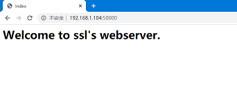
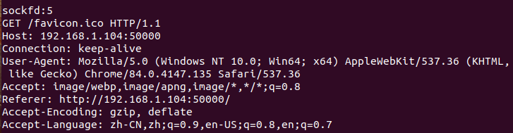

# myTinyHttpServer
## 项目介绍
一个超轻量级的http服务器。通过实现这个项目复习Linux系统编程的相关知识，并了解http服务器的本质。  
该服务器采用select模型，仅可以处理静态资源。  
<div align=center>

<p></p>

</div>

## 目录结构
```
myTinyHttpServer:
│  httpd
│  httpd.c	
│  README.md
│  wrap.c
│  wrap.h
└─webapp
        favicon.ico
        index.html
        test.html
```
httpd 编译出来的二进制文件  
httpd.c 源文件  
wrap.h 包裹函数头文件  
wrap.c 包裹函数源文件  
webapp web服务器存放资源的跟目录  

## 安装与使用
- 编译  
`gcc httpd.c -o httpd`  
- 运行  
`./httpd`  
默认绑定50000端口
## myTinyHttpServer工作流程
1)	创建服务器套接字，并绑定监听
2)	采用select模型阻塞套接字
3)	判断是服务器套接字还是连接套接字。如果是服务器套接字，保存连接套接字，跳转到3；如果是连接套接字，读取http请求包，跳转到4。
4)	判断http请求的方法是否为GET。如果是，解析url；否则发送unimpented响应包。
5)	判断url是否以’/’结尾。如果是，将index.html拼接至尾部，形成文件path
6)	判断path是否存在。存在则发送文件响应包；否则，发送unfound响应包
7)	跳转到2

## 问题
当网页在刷新时，如何关闭浏览器，服务器会自动退出。
